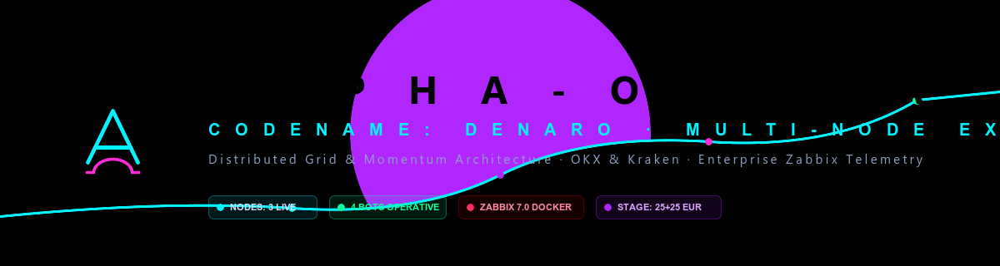
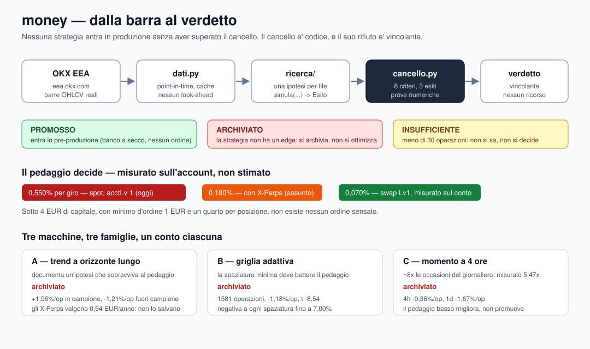
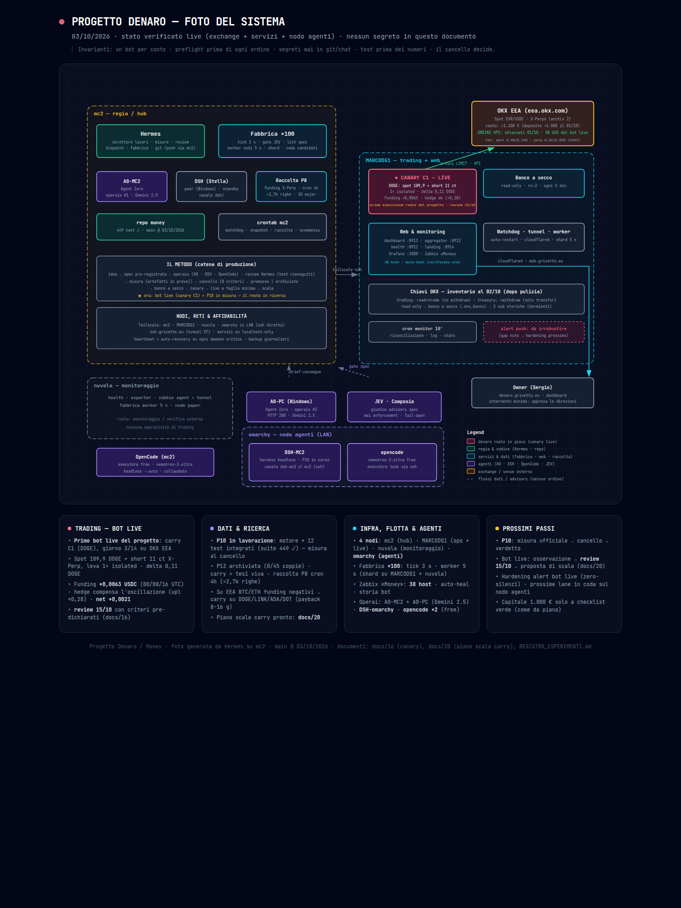

<p align="center">
  
</p>

# money — «el peaje antes de la estrategia»

<p align="center">
  
</p>

<p align="center">
  <a href="https://www.python.org/"></a>
  <a href="https://www.okx.com/en-eu"></a>
  <a href="https://github.com/ccxt/ccxt"></a>
  <a href="https://www.docker.com/"></a>
  <a href="https://www.zabbix.com/"></a>
  <a href="LICENSE"></a>
</p>

> **Ninguna estrategia llega a producción sin pasar la puerta:** expectativa neta positiva
> **fuera de muestra**, a los **costes reales** de la cuenta en la que va a correr.
> La puerta no es una orientación: es código, y su rechazo es vinculante.

Bajo el nombre *denaro* **cuatro** bases de código se sucedieron — `C:\dev\denaro` (Binance,
móvil), el `money` anterior (grid, DCA, scalper, hedge, futuros, sentimiento),
`alpha-omega-trading` (49.162 líneas, 17 bots, tres máquinas) y `~/denaro2` en los VPS — y
**ninguna de ellas ganó un solo euro**. No por bugs: porque el sistema se construyó *primero*
y se buscó *después* algo que capturar. Aquí el orden está invertido, y el código anterior
vive en `legacy/`, versionado con su historia, como memoria de lo que se intentó — no como
cimiento sobre el que construir.

<p align="center">
  <a href="README.md"><b>English</b></a> •
  <a href="README.it.md"><b>Italiano</b></a> •
  <a href="README.es.md"><b>Español</b></a> •
  <a href="README.th.md"><b>ไทย</b></a>
</p>

---

## 📊 Estado de un vistazo — 2026-10-03

| | |
| :--- | :--- |
| **Tests** | **533 passed**, `ruff` limpio, en **dos entornos independientes** |
| **Estrategias medidas** | **3** familias (una por nodo), todas juzgadas a costes reales |
| **Veredictos** | **3 archivadas** (familias) — el carry en vivo **C1** está en su ventana de validación canary (review 15/10) |
| **Órdenes reales enviadas** | **0** por las estrategias de este repo — el primer bot en vivo del proyecto (carry **C1**, DOGE) opera en OKX EEA y se sigue en `alpha-omega-trading` (`docs/16`) |
| **Capital** | **~1,100 EUR** en las cuentas de OKX (verificado en solo lectura) — el propietario depositó **+1.000 EUR el 03/10** para escalar el carry (despliegue condicionado a la revisión del 15/10); el canary en vivo (carry de DOGE, autorizado) opera en la cuenta principal |
| **Último commit** | `main` — ver `git log` para el head actual |

Repositorio: `C:\dev\money` en local, `github.com/grivetto/money` en remoto. Paquete Python bajo
`src/money/`, tests bajo `tests/`, evidencia bajo `prove/`, decisiones bajo `docs/`.

---

## 📜 La historia — de «La Baracca» a un rig medido

*«La Baracca»* — el «cacharro» que siempre necesita otro parche: durante un año el proyecto fue
exactamente eso — bots que corrían, números que no cuadraban, cero euros ganados. El punto de
inflexión fue una decisión: dejar de construir y empezar a medir, hasta convertir la medición en
un **cancello** de 8 criterios. Desde el 01/10 un canary carry (DOGE) opera con dinero real
(review 15/10) y el capital es de ~1.100 EUR. La historia completa: `README.md` / `README.it.md`.

---

## 🏛 Arquitectura — de la barra al veredicto



El pipeline es unidireccional y no tiene atajos: **barras reales dentro, un veredicto numérico
fuera**. Nada entra en producción desde la izquierda de la puerta.

```
OKX EEA (eea.okx.com)          real OHLCV bars, point-in-time, cached, no look-ahead
      |
      v
money/dati.py                  Barra, SerieBarre, Scarica, walk-forward with embargo
      |
      v
money/ricerca/                 one hypothesis per file: simula(...) -> Esito
      |                        nothing here may promote anything by itself
      v
money/cancello.py              8 criteria, 3 verdicts, every reason carries its number
      |
      v
promosso / archiviato / insufficiente          the verdict is binding
```

### El sistema alrededor de la pipeline — actualizado 02/10/2026



**Primer bot en vivo del proyecto**: carry C1 (DOGE) en OKX EEA desde el 01/10 — tamaño mínimo, totalmente reconciliado, review el 15/10. Alrededor: los cuatro nodos (mc2 hub · MARCODG1 ops + live · nuvola monitorización · **omarchy agentes**: DSH + OpenCode), la fábrica ×100 (tick 3 s, worker 5 s), los operarios A0-mc2/A0-win (Gemini 2.5), DSH ×3 (mc2/omarchy/win), los ejecutores free OpenCode ×2 + agy-omarchy y el juez advisory JEV.

*Visual: [`FOTO_SISTEMA_2026-10-03.html`](FOTO_SISTEMA_2026-10-03.html) · [`.png`](FOTO_SISTEMA_2026-10-03.png). Fotos anteriores: [`ARCHITETTURA_2026-09-30.md`](ARCHITETTURA_2026-09-30.md) · [`ARCHITETTURA_2026-10-01.md`](ARCHITETTURA_2026-10-01.md).*

### Tecnologías centrales

| Capa | Tecnología | Por qué esta |
| :--- | :--- | :--- |
| Lenguaje | **Python** (`requires-python >= 3.11`; ejecutado en 3.12.3 y 3.14.5) | el único lenguaje en el que el andamiaje de investigación del proyecto anterior podía auditarse línea por línea |
| Acceso al exchange | **ccxt >= 4.0** contra **`eea.okx.com`** | las claves de la UE funcionan *solo* en el endpoint EEA: en `okx.com` toda clave responde `50119 "API key doesn't exist"`, que se parece exactamente a una clave muerta |
| Datos de mercado | **OKX EEA REST**, velas diarias y de 4h/1h, paginadas | una sede, un timeframe por nodo: el andamiaje de investigación y el andamiaje en vivo deben leer los mismos datos |
| Integridad de los datos | **`money/dati.py`** — epoch en milisegundos UTC, `vista_fino_a`, `finestre_indici`, `iterazioni_walk_forward(embargo=1)`, `SerieBarre.verifica()` | el look-ahead es el defecto que produce números excelentes y cuentas perdedoras, y no deja rastro |
| Modelado del dominio | **`dataclasses`** (`frozen=True`), `enum`, type hints completos, funciones puras | el módulo de costes no tiene I/O: no puede mentir, y se testea en milisegundos |
| Modelo de costes | **`money/costi.py`** — fracciones, nunca porcentajes (`0.0035`, no `0.35`) | para que ningún error de factor 100 pueda esconderse en una multiplicación |
| Puerta | **`money/cancello.py`** — intervalo de confianza bootstrap al 90% con semilla fija, t-stat, profit factor, drawdown, cobertura del peaje, relevancia económica, independencia de bloques | un criterio que no puedes ver no se puede discutir |
| Tests | **pytest >= 8** (533 tests), **ruff >= 0.5** (`line-length = 120`, reglas `E9`+`F`) | solo reglas que atrapan errores reales: un CI que grita siempre no protege nada |
| Config / empaquetado | **PyYAML >= 6**, **setuptools** (layout `src/`) | `pytest` importa el paquete desde `src/` sin instalación, así que la suite corre en un checkout fresco |
| Evidencia | **artefactos JSON + texto plano** en `prove/`, decisiones en Markdown en `docs/` | una medición que no se puede releer es una opinión |
| Control de versiones | **git**, un escritor por ruta, systemd/cron a versionar en `deploy/` | el `systemd` y el `crontab` del proyecto anterior no estaban versionados, y eso causó 10 de 12 caídas |
| Deliberadamente **ausente** | ningún LLM en el hot path, ningún framework async, ningún código de envío de órdenes, ningún dashboard web | el coste por decisión de un LLM es comparable a la ventaja que se persigue; la ejecución se construye *después* de la primera promoción |

### Las tres máquinas

Tres máquinas, **una familia de estrategia cada una**, una cuenta OKX dedicada cada una. No es una
elección estética: es la corrección de un defecto medido sobre el terreno.

| nodo | familia | qué debe demostrar | veredicto |
| :--- | :--- | :--- | :--- |
| **A** | tendencia de largo horizonte | que sobrevive al peaje real | **archivada** |
| **B** | grid adaptativa | que el espaciado mínimo supera el peaje | **archivada** |
| **C** | momento de 4 horas | que resiste los costes | **archivada** |

**Por qué una cuenta por máquina.** En el proyecto anterior cada bot declaraba el capital de la
cuenta *entera*: con 7 bots el riesgo agregado era del **14% en lugar del 2%**, y el stop de un bot
liquidaba el inventario de otro bot. Medido, no hipotetizado.

**Por qué el riesgo es a nivel de cartera.** El presupuesto del 2% pertenece al capital *total*:
tres nodos no pueden arriesgar 2% cada uno.

---

## 🚦 La puerta — 8 criterios, 3 veredictos

Los ocho deben pasar. El veredicto es uno de tres, y «insuficiente» es un veredicto real, no una
excusa.

| # | Criterio | Umbral |
| :--- | :--- | :--- |
| 1 | Tamaño de muestra | `>= 30` operaciones, si no **insuficiente** |
| 2 | Expectativa | intervalo de confianza bootstrap al 90%, límite inferior `> 0`, semilla fija |
| 3 | t-statistic | `> 1.65` (una cola, 5%) — siempre reportado, incluso cuando falla |
| 4 | Profit factor | `> 1.20` |
| 5 | Drawdown | `<= 25%` del capital |
| 6 | **Peaje cubierto** | expectativa neta `>= 3x` el coste de ida y vuelta de la tarifa asumida |
| 7 | Relevancia económica | `>= 10 EUR/año` esperados, sobre un capital de referencia de 1000 EUR |
| 8 | Independencia de bloques | quitar el mejor bloque no debe volver negativa la expectativa |

El criterio 6 es el que el proyecto anterior nunca tuvo. El criterio 8 existe porque el proyecto
anterior tenía **todo su retorno en un bloque de tres** y nadie se había dado cuenta.

---

## 💰 La economía — medida, no estimada

La tarifa ya no es una suposición: se lee de la cuenta.

| tarifa | maker | taker | ida y vuelta mixta | procedencia |
| :--- | ---: | ---: | ---: | :--- |
| `okx_eea_spot` | 0.20% | 0.35% | **0.550%** | confirmada desde la cuenta (`privateGetAccountTradeFee`) |
| `okx_eea_con_perp` | 0.08% | 0.10% | 0.180% | suposición conservadora, mantenida a propósito |
| `okx_eea_swap_lv1` | 0.02% | 0.05% | **0.070%** | medida en la cuenta, válida solo con derivados activos (`acctLv 2`) |

**Abrir X-Perps baja el peaje 7,86x sin añadir un euro de capital.** La cuenta está
actualmente en `acctLv: "1"` (solo spot): la tarifa de swap es un escenario, no un coste pagado, y la
suite de tests prohíbe sustituir la suposición por la cifra medida hasta que el nivel de la cuenta
suba de verdad.

Y el número que el proyecto anterior nunca calculó: **por debajo de 4 EUR de capital**, con una
orden mínima de 1 EUR y un cuarto por posición, **no existe ninguna orden sensata**.

---

## 🧪 Testing — y la reproducción independiente

```
533 passed
ruff check . → All checks passed
```

Ejecutado en **dos entornos**, desde un **clon limpio** de `origin/main`:

| | entorno A (autor) | entorno B (reproducción) |
| :--- | :--- | :--- |
| máquina | estación de trabajo Windows | mc2, Linux |
| Python | 3.14.5 | 3.12.3 |
| ccxt | 4.5.40 | 4.5.84 |

Las mediciones se reproducen **dígito por dígito**: nodo A `+1.959026%`, t `0.821`, PF `1.420`,
DD `53.18%`; nodo B `-1.1823%`, t `-8.539`, PF `0.569`, cobertura del peaje `-2.150x`. Ver
`docs/04_riproduzione_indipendente_2026-09-25.md`.

Lo que eso demuestra es que los números no dependen del entorno y que el repositorio
publicado es autosuficiente. Lo que **no** demuestra es que el método sea correcto: es el
mismo código ejecutado en otro sitio. La comprobación fuerte sería una **segunda implementación
independiente** — dos agentes escribiendo dos motores y comparando números. No se ha hecho, y decirlo es más
útil que esconderlo detrás de un «verificado».

---

## 📉 Los tres veredictos — qué archivó la puerta, y por qué

| nodo | veredicto | el número que lo decide |
| :--- | :--- | :--- |
| A — tendencia larga | **archivada** | in-sample `+1.96%/op`, **out-of-sample `-1.21%/op`** (t `-0.44`); solo 2 de 9 ventanas cortas positivas, y **0 ventanas con >= 5 operaciones** |
| B — grid adaptativa | **archivada** | **1581 operaciones**, neto `-1.18%/op`, **t `-8.54`**, PF `0.569` |
| C — momento 4h | **archivada** | 4h neto `-0.36%/op`, 1d neto `-1.67%/op`; la palanca de costes es visible (cobertura `-0.654` → `1.716`, EUR/año `-208` → `+69.61`) y **aun así no es suficiente** |

Tres hallazgos que sobreviven a los veredictos:

1. **Para la tendencia, el peaje es irrelevante.** Fuera de muestra la ventaja cambia de signo; abrir
   X-Perps vale **0,94 EUR/año** sobre esa ventaja. Ningún recorte de comisión crea una ventaja.
2. **La grid tiene un defecto estructural, no de ajuste.** Un barrido de espaciado fijo es negativo desde
   `0.10%` hasta `7.00%`; el break-even **no se alcanzó ni con 12,7x el peaje**, y el 98,672% de las
   operaciones tenían un espaciado *por encima* del peaje (4,4x–8,6x) mientras seguían perdiendo 1,18% por operación.
   La razón: +1 ciclo gana `s`, pero −1 ruptura de banda liquida el inventario a mercado y cuesta
   alrededor de `3s`. El diagnóstico del proyecto anterior («el espaciado está por debajo del peaje») era **correcto pero
   incompleto**: subirlo no basta.
3. **La palanca de costes es real y ahora está medida, y no promociona nada.** En el 4H, 1 criterio
   de 8 cambia (relevancia económica) y el veredicto no se mueve.

Registro completo: `docs/03_verdetti_2026-09-25.md`, evidencia bruta en `prove/`.

---

## 🚫 Lo que está prohibido aquí (lecciones pagadas en efectivo)

1. **Ninguna ejecución antes de una ventaja promocionada.** El proyecto anterior tenía 17 bots y cero
   operaciones verificadas.
2. **Ninguna afirmación de rendimiento sin reconciliación** contra saldos y órdenes reales.
3. **Ningún capital configurado que la cuenta no tenga.** Un nodo sin fondos debe decir
   `NON FINANZIATO`, no saltarse ticks en silencio (1.486 ticks perdidos sin una sola alarma).
4. **Ninguna orden sin clave de idempotencia.** Una caída entre el envío y el guardado deja dinero comprometido
   que el bot no puede ver.
5. **Ninguna telemetría que se lea como un fósil.** Un archivo viejo no es un bot en marcha.
6. **Ningún LLM en el hot path.** En la sombra, sí; decidiendo, no.
7. **Ninguna deriva de rutas**: systemd y cron versionados bajo `deploy/`, con un
   `PROJECT_ROOT` paramétrico. Causó 10 de 12 caídas.
8. **Ningún umbral bajado para hacer pasar algo.** Si la puerta archiva, está archivado.

---

## 📁 Estructura del repositorio

```
money/
├── src/money/
│   ├── costi.py              the toll mathematics: minimum move, sustainable frequency, feasibility
│   ├── dati.py               real OHLCV bars, point-in-time, cache, no look-ahead
│   ├── cancello.py           the promotion gate: 8 criteria, 3 verdicts
│   └── ricerca/              the hypotheses, one per file
│       ├── trend_lungo.py        node A — long-horizon trend
│       ├── griglia_adattiva.py   node B — adaptive grid
│       └── momento_4h.py         node C — 4-hour momentum
├── scripts/                  measurement runners, one per hypothesis, plus independent checks
├── tests/                    533 offline tests
├── docs/                     01 decision · 02 dry-run bench spec · 03 verdicts · 04 reproduction
├── prove/                    raw evidence: verdicts, JSON, comparison with prior evidence
├── assets/                   banner and architecture diagram
├── legacy/                   the previous codebase, with its history — memory, not foundation
└── pyproject.toml
```

---

## 🛠 Inicio rápido

```bash
git clone https://github.com/grivetto/money.git
cd money

# the toll mathematics
python src/money/costi.py

# the whole suite (offline, no keys, no network)
python -m pytest tests -q          # 533 passed
ruff check .

# re-measure a hypothesis on real OKX EEA bars (no keys needed: public data)
export MONEY_CACHE=/tmp/money_cache
python scripts/misura_trend_lungo.py

# show the gate deciding on the same series at two different tolls
python demo_cancello.py
```

---

## 🚧 Trabajo abierto, por orden de valor

1. **Decisión del propietario — evaluación de X-Perps.** `acctLv` 1 → 2. Es la palanca más grande que el proyecto
   tiene, valía 7,86x sobre el peaje, y no es código: resuelto el 30/09 — `acctLv 2` abierto en OKX EEA.
2. **Decisiones del propietario — resoluciones del 03/10.** Capital depositado (~1.100 EUR) para la escala del
   carry; el deploy espera la review del 15/10 con criterios pre-registrados.
3. **Release de validación M1** (reglas del 30/09): block bootstrap, DSR/PBO, escenarios de coste ×3 —
   `coda_catena/M1_release_validacion.md`; en espera del OK del propietario.
   El capital no crea la ventaja: la hace visible.
4. **Banco de pruebas en seco** (spec en `docs/02`): lee el saldo real, aplica la
   guarda `NON FINANZIATO`, calcula la orden y **no envía nada**. La implementación pertenece a `deploy/`.
5. **Una cuarta pregunta, no una cuarta estrategia.** Con tres familias archivadas, la pregunta ya no es
   «qué estrategia viene después» sino **qué hace que una ventaja sea encontrable** bajo este peaje, en estos
   mercados, con este capital.

---

## 🗺 Ruta de escalado

```
gate (done) → first promoted edge (still missing) → capital (arrived: ~1.1k EUR, deploy gated on the 15/10 review) → frequency
```

El orden no es negociable, y es exactamente el inverso de lo que hizo el proyecto anterior.

---

## ⚖️ Disclaimer

Esto es código de investigación sobre una cuenta real de ~1.100 EUR — con un canary de carry a tamaño mínimo, autorizado y reconciliado. Las estrategias no envían órdenes, y no hay módulo de
ejecución por diseño. Nada de esto es asesoramiento de inversión. Los criptoactivos pueden perder todo su valor;
la matemática en `costi.py` existe precisamente para mostrar con qué frecuencia eso ocurre en silencio, un peaje
cada vez.

## 📄 Licencia

Publicado bajo la **European Union Public Licence v. 1.1 (EUPL-1.1)**. Véase [LICENSE](LICENSE).
El proyecto padre (`alpha-omega-trading`) se publica bajo la misma licencia.
