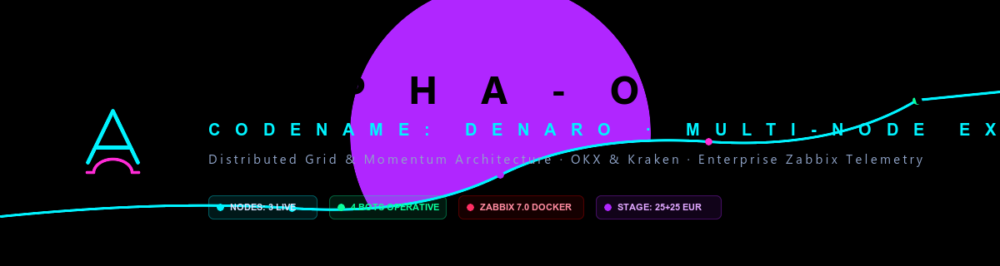
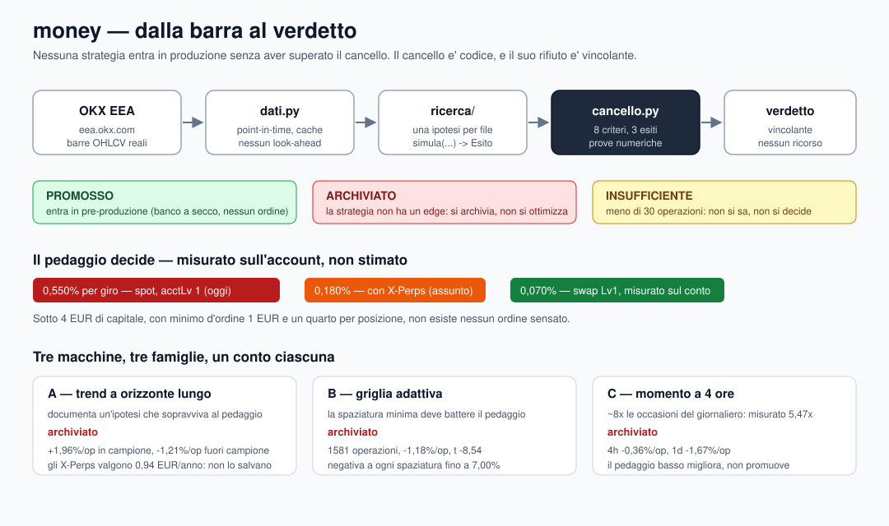

# money — «the toll before the strategy»

> **No strategy reaches production without passing the gate:** positive net expectancy
> **out of sample**, at the **real costs** of the account it will run on.
> The gate is not a guideline: it is code, and its rejection is binding.

Under the name *denaro* **four** codebases succeeded one another — `C:\dev\denaro` (Binance,
mobile), the previous `money` (grid, DCA, scalper, hedge, futures, sentiment),
`alpha-omega-trading` (49,162 lines, 17 bots, three machines) and `~/denaro2` on the VPSes — and
**none of them earned a single euro**. Not because of bugs: because the system was built *first*
and something to capture was looked for *afterwards*. Here the order is inverted, and the previous
code lives in `legacy/`, tracked with its history, as a memory of what was tried — not as a
foundation to build on.

<p align="center">
  <a href="README.md"><b>English</b></a> •
  <a href="README.it.md"><b>Italiano</b></a> •
  <a href="README.es.md"><b>Español</b></a> •
  <a href="README.th.md"><b>ไทย</b></a>
</p>

---

## 📊 Status at a glance — 2026-09-25

| | |
| :--- | :--- |
| **Tests** | **136 passed**, `ruff` clean, in **two independent environments** |
| **Strategies measured** | **3** families (one per node), all judged at real costs |
| **Verdicts** | **3 archived** — nothing promoted, therefore nothing in production |
| **Real orders sent** | **0** (and it stays that way until the gate promotes and the owner funds) |
| **Capital** | **26.0030 EUR** on the OKX main account, verified read-only; the live fleet holds ~0.15 EUR of dust |
| **Last commit** | `main` — see `git log` for the current head |

Repository: `C:\dev\money` locally, `github.com/grivetto/money` remotely. Python package under
`src/money/`, tests under `tests/`, evidence under `prove/`, decisions under `docs/`.

---

## 🏛 Architecture — from the bar to the verdict



The pipeline is one-way and has no shortcuts: **real bars in, a numerical verdict out**. Nothing
enters production from the left of the gate.

```
OKX EEA (eea.okx.com)          real OHLCV bars, point-in-time, cached, no look-ahead
      |
      v
money/dati.py                  Barra, SerieBarre, Scarica, walk-forward with embargo
      |
      v
money/ricerca/                 one hypothesis per file: simula(...) -> Esito
      |                        nothing here may promote anything by itself
      v
money/cancello.py              8 criteria, 3 verdicts, every reason carries its number
      |
      v
promosso / archiviato / insufficiente          the verdict is binding
```

### Core technologies

| Layer | Technology | Why this one |
| :--- | :--- | :--- |
| Language | **Python** (`requires-python >= 3.11`; run on 3.12.3 and 3.14.5) | the only language in which the previous project's research rig could be audited line by line |
| Exchange access | **ccxt >= 4.0** against **`eea.okx.com`** | EU keys work *only* on the EEA endpoint: on `okx.com` every key answers `50119 "API key doesn't exist"`, which looks exactly like a dead key |
| Market data | **OKX EEA REST**, daily and 4h/1h candles, paginated | one venue, one timeframe per node: the research rig and the live rig must read the same data |
| Data integrity | **`money/dati.py`** — millisecond epoch UTC, `vista_fino_a`, `finestre_indici`, `iterazioni_walk_forward(embargo=1)`, `SerieBarre.verifica()` | look-ahead is the defect that produces excellent numbers and losing accounts, and it leaves no trace |
| Domain modelling | **`dataclasses`** (`frozen=True`), `enum`, full type hints, pure functions | the cost module has no I/O: it cannot lie, and it tests in milliseconds |
| Cost model | **`money/costi.py`** — fractions, never percentages (`0.0035`, not `0.35`) | so that no factor-of-100 error can hide in a multiplication |
| Gate | **`money/cancello.py`** — bootstrap CI at 90% with a fixed seed, t-stat, profit factor, drawdown, toll coverage, economic relevance, block independence | a criterion you cannot see cannot be discussed |
| Tests | **pytest >= 8** (136 tests), **ruff >= 0.5** (`line-length = 120`, rules `E9`+`F`) | only rules that catch real errors: a CI that always shouts protects nothing |
| Config / packaging | **PyYAML >= 6**, **setuptools** (`src/` layout) | `pytest` imports the package from `src/` with no installation, so the suite runs on a fresh checkout |
| Evidence | **JSON + plain-text artifacts** in `prove/`, Markdown decisions in `docs/` | a measurement that cannot be re-read is an opinion |
| Version control | **git**, one writer per path, systemd/cron to be versioned in `deploy/` | the previous project's `systemd` and `crontab` were unversioned, and that caused 10 of 12 outages |
| Deliberately **absent** | no LLM in the hot path, no async framework, no order-sending code, no web dashboard | an LLM's cost per decision is comparable to the edge being hunted; execution is built *after* the first promotion |

### The three machines

Three machines, **one strategy family each**, one dedicated OKX account each. Not an aesthetic
choice: it is the correction of a defect measured on the field.

| node | family | what it must prove | verdict |
| :--- | :--- | :--- | :--- |
| **A** | long-horizon trend | that it survives the real toll | **archived** |
| **B** | adaptive grid | that the minimum spacing beats the toll | **archived** |
| **C** | 4-hour momentum | that it withstands costs | **archived** |

**Why one account per machine.** In the previous project every bot declared the capital of the
*whole* account: with 7 bots the aggregate risk was **14% instead of 2%**, and one bot's stop
liquidated another bot's inventory. Measured, not hypothesised.

**Why risk is portfolio-level.** The 2% budget belongs to the *total* capital: three nodes cannot
each risk 2%.

---

## 🚦 The gate — 8 criteria, 3 verdicts

All eight must pass. The verdict is one of three, and "insufficient" is a real verdict, not an
excuse.

| # | Criterion | Threshold |
| :--- | :--- | :--- |
| 1 | Sample size | `>= 30` operations, else **insufficient** |
| 2 | Expectancy | bootstrap CI at 90%, lower bound `> 0`, fixed seed |
| 3 | t-statistic | `> 1.65` (one tail, 5%) — always reported, even when it fails |
| 4 | Profit factor | `> 1.20` |
| 5 | Drawdown | `<= 25%` of capital |
| 6 | **Toll covered** | net expectancy `>= 3x` the round-trip cost of the assumed tariff |
| 7 | Economic relevance | `>= 10 EUR/year` expected, on a 1000 EUR reference capital |
| 8 | Block independence | removing the best block must not turn expectancy negative |

Criterion 6 is the one the previous project never had. Criterion 8 exists because the previous
project had **all of its return in one block out of three** and nobody had noticed.

---

## 💰 The economics — measured, not estimated

The tariff is not an assumption any more: it is read from the account.

| tariff | maker | taker | mixed round trip | provenance |
| :--- | ---: | ---: | ---: | :--- |
| `okx_eea_spot` | 0.20% | 0.35% | **0.550%** | confirmed from the account (`privateGetAccountTradeFee`) |
| `okx_eea_con_perp` | 0.08% | 0.10% | 0.180% | conservative assumption, kept on purpose |
| `okx_eea_swap_lv1` | 0.02% | 0.05% | **0.070%** | measured on the account, valid only with derivatives active (`acctLv 2`) |

**Opening X-Perps lowers the toll by 7.86x without adding a euro of capital.** The account is
currently `acctLv: "1"` (spot only): the swap tariff is a scenario, not a paid cost, and the test
suite forbids replacing the assumption with the measured figure until the account level actually
rises.

And the number the previous project never computed: **below 4 EUR of capital**, with a 1 EUR
minimum order and a quarter per position, **no sensible order exists**.

---

## 🧪 Testing — and the independent reproduction

```
136 passed
ruff check . → All checks passed
```

Run in **two environments**, from a **clean clone** of `origin/main`:

| | environment A (author) | environment B (reproduction) |
| :--- | :--- | :--- |
| machine | Windows workstation | mc2, Linux |
| Python | 3.14.5 | 3.12.3 |
| ccxt | 4.5.40 | 4.5.84 |

The measurements reproduce **digit for digit**: node A `+1.959026%`, t `0.821`, PF `1.420`,
DD `53.18%`; node B `-1.1823%`, t `-8.539`, PF `0.569`, toll coverage `-2.150x`. See
`docs/04_riproduzione_indipendente_2026-09-25.md`.

What that proves is that the numbers do not depend on the environment and that the published
repository is self-sufficient. What it does **not** prove is that the method is right: it is the
same code run elsewhere. The strong check would be a **second independent implementation** — two
agents writing two engines and comparing numbers. It has not been done, and saying so is more
useful than hiding it behind a "verified".

---

## 📉 The three verdicts — what the gate archived, and why

| node | verdict | the number that decides it |
| :--- | :--- | :--- |
| A — long trend | **archived** | in-sample `+1.96%/op`, **out-of-sample `-1.21%/op`** (t `-0.44`); only 2 of 9 short windows positive, and **0 windows with >= 5 operations** |
| B — adaptive grid | **archived** | **1581 operations**, net `-1.18%/op`, **t `-8.54`**, PF `0.569` |
| C — 4h momentum | **archived** | 4h net `-0.36%/op`, 1d net `-1.67%/op`; the cost lever is visible (coverage `-0.654` → `1.716`, EUR/year `-208` → `+69.61`) and **still not enough** |

Three findings that outlive the verdicts:

1. **For the trend, the toll is irrelevant.** Out of sample the edge changes sign; opening
   X-Perps is worth **0.94 EUR/year** on that edge. No commission cut creates an edge.
2. **The grid has a structural defect, not a tuning one.** A fixed-spacing sweep is negative from
   `0.10%` to `7.00%`; break-even was **not reached even at 12.7x the toll**, and 98.672% of
   operations had spacing *above* the toll (4.4x–8.6x) while still losing 1.18% per operation.
   The reason: +1 cycle earns `s`, but −1 band break liquidates the inventory at market and costs
   about `3s`. The previous project's diagnosis ("spacing is below the toll") was **correct but
   incomplete**: raising it is not enough.
3. **The cost lever is real and now measured, and it promotes nothing.** On the 4H, 1 criterion
   out of 8 flips (economic relevance) and the verdict does not move.

Full record: `docs/03_verdetti_2026-09-25.md`, raw evidence in `prove/`.

---

## 🚫 What is forbidden here (lessons paid for in cash)

1. **No execution before a promoted edge.** The previous project had 17 bots and zero verified
   trades.
2. **No performance claim without reconciliation** against real balances and orders.
3. **No configured capital the account does not have.** A node without funds must say
   `NON FINANZIATO`, not skip ticks silently (1,486 ticks lost without a single alarm).
4. **No order without an idempotency key.** A crash between send and save leaves committed money
   the bot cannot see.
5. **No telemetry that reads like a fossil.** An old file is not a running bot.
6. **No LLM in the hot path.** In shadow, yes; deciding, no.
7. **No path drift**: systemd and cron versioned under `deploy/`, with a parametric
   `PROJECT_ROOT`. It caused 10 of 12 outages.
8. **No threshold lowered to make something pass.** If the gate archives, it is archived.

---

## 📁 Repository layout

```
money/
├── src/money/
│   ├── costi.py              the toll mathematics: minimum move, sustainable frequency, feasibility
│   ├── dati.py               real OHLCV bars, point-in-time, cache, no look-ahead
│   ├── cancello.py           the promotion gate: 8 criteria, 3 verdicts
│   └── ricerca/              the hypotheses, one per file
│       ├── trend_lungo.py        node A — long-horizon trend
│       ├── griglia_adattiva.py   node B — adaptive grid
│       └── momento_4h.py         node C — 4-hour momentum
├── scripts/                  measurement runners, one per hypothesis, plus independent checks
├── tests/                    136 offline tests
├── docs/                     01 decision · 02 dry-run bench spec · 03 verdicts · 04 reproduction
├── prove/                    raw evidence: verdicts, JSON, comparison with prior evidence
├── assets/                   banner and architecture diagram
├── legacy/                   the previous codebase, with its history — memory, not foundation
└── pyproject.toml
```

---

## 🛠 Quick start

```bash
git clone https://github.com/grivetto/money.git
cd money

# the toll mathematics
python src/money/costi.py

# the whole suite (offline, no keys, no network)
python -m pytest tests -q          # 136 passed
ruff check .

# re-measure a hypothesis on real OKX EEA bars (no keys needed: public data)
export MONEY_CACHE=/tmp/money_cache
python scripts/misura_trend_lungo.py

# show the gate deciding on the same series at two different tolls
python demo_cancello.py
```

---

## 🚧 Open work, in order of value

1. **Owner decision — X-Perps assessment.** `acctLv` 1 → 2. It is the largest lever the project
   has, it is worth 7.86x on the toll, and it is not code. On EEA it may depend on MiCA: to be
   verified with OKX.
2. **Owner decision — where the 26 EUR go.** The main account is not a node: the architecture is
   one node = one family = one dedicated subaccount.
3. **Owner decision — the 1000 EUR.** At 26 EUR the gate's relevance threshold demands 38.5% net
   per year; at 1000 EUR it demands 1.0%. Capital does not create the edge: it makes the gain
   visible.
4. **Dry-run bench** (spec in `docs/02`): reads the real balance, applies the `NON FINANZIATO`
   guard, computes the order and **sends nothing**. Implementation belongs to `deploy/`.
5. **A fourth question, not a fourth strategy.** With three families archived, the question is no
   longer "which strategy next" but **what makes an edge findable** under this toll, on these
   markets, with this capital.

---

## 🗺 Scaling path

```
gate (done) → first promoted edge (missing) → capital (26 EUR now, 1000 EUR next) → frequency
```

The order is not negotiable, and it is the exact inverse of what the previous project did.

---

## ⚖️ Disclaimer

This is research code on a real account of 26 EUR. It sends no orders, and it has no execution
module by design. Nothing here is investment advice. Crypto assets can lose all of their value;
the mathematics in `costi.py` exists precisely to show how often that happens silently, one toll
at a time.

## 📄 License

**No `LICENSE` file exists in this repository.** The parent project
(`alpha-omega-trading`) is released into the **public domain**. A licence for `money` has not
been declared and has not been invented here: it is the owner's decision.
